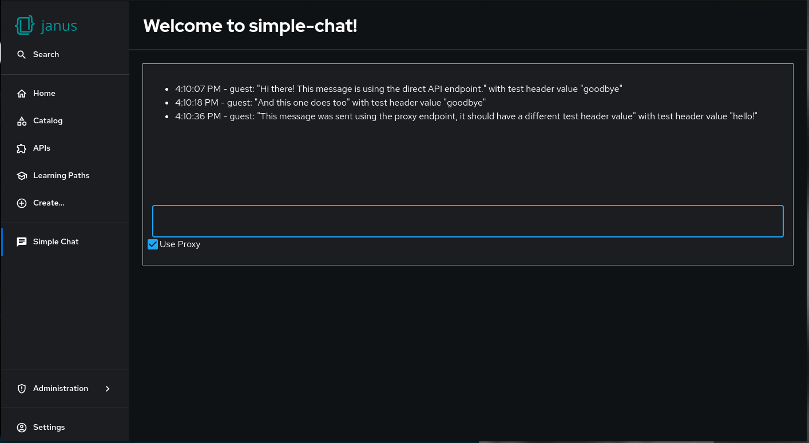

# Using Custom Middleware In Red Hat Developer Hub

## Overview

> [!NOTE]
> The Dynamic Plugin functionality is a tech preview feature of Red Hat Developer Hub and is still under active development.  Aspects of developing, packaging and deploying dynamic plugins are suject to change.

This example shows how a dynamic plugin can install a custom middleware function into the root HttpRouterService used in Red Hat Developer Hub to handle lower-level cross-cutting concerns such as handling custom HTTP headers.  This functionality is available in version 1.4 of Developer Hub but disabled by default.

The ability to install a custom middleware function from a dynamic plugin requires setting the `DISABLE_STATIC_ROOT_HTTP_ROUTER_CONFIG` environment variable to `true`.  If this variable is not set then the Developer Hub backend will exit with a duplicate service implementation error for the `core.rootHttpRouter` service.

### Prerequisites

- node 20.x
- yarn (3.8.3 was used during development)

To run the example locally:

- podman or docker

## About the Example

This example consists of 3 plugins in total, a [frontend](./plugins/simple-chat) and [backend](./plugins/simple-chat-backend) plugin that are a modified version of the [simple-chat getting started example](https://github.com/gashcrumb/dynamic-plugins-getting-started) and a third plugin called "[middleware-header-example](./middleware-header-example)" that installs a custom middleware function.  The proxy backend is also used as part of this example with [this configuration](./app-config.yaml#L26-L32).  To keep the example simple to build and run HTTP and guest authentication is used and the example scenario is somewhat contrived to avoid any external requirements.

The [simple-chat-backend](./plugins/simple-chat-backend) plugin has been updated in this example to also [check for a custom HTTP header](./plugins/simple-chat-backend/src/service/router.ts#L39-L48).  If present it will add it to the incoming message which will be served out to simple-chat clients.

The [simple-chat](./plugins/simple-chat) plugin has been updated in this example to provide a checkbox in the UI to either send it's message using the direct simple-chat API *or* alternatively use a pre-configured proxy endpoint.  When using the direct API endpoint, no custom HTTP header is sent.  When using the proxy endpoint, the proxy is configured to send the string `hello!` in the `X-PROXY-TEST-HEADER` HTTP header.

Finally the [middleware-header-example](./plugins/middleware-header-example) plugin contains a custom middleware that acts on requests sent to the `/api/simple-chat` [endpoint](./plugins/middleware-header-example/src/index.ts#L16).  The middleware will check for the presence of the `X-PROXY-TEST-HEADER` header, and if not present, it will set a value for this header to `goodbye`, otherwise it will just pass along the existing header value.

## Building the Example

To build this example run the following commands:

```terminal
yarn install
```

```terminal
yarn tsc
```

```terminal
yarn build
```

## Running the Example

### Using podman (or docker)

To run this example locally with `podman` using all defaults run the following:

```terminal
yarn package-dynamic-plugins
```

```terminal
bash 01-run-with-podman.sh
```

Use a custom image tag for the plugin via the `PLUGIN_IMAGE_TAG` environment variable.  The script to run the container is set up to use the configuration in [app-config.yaml](./app-config.yaml).

### Using rhdh-local

> [!WARNING]
> This section is still under construction

To run this example using [rhdh-local](https://github.com/redhat-developer/rhdh-local) first run the following to export the dynamic plugins to it's `local-plugins` directory:

```terminal
DYNAMIC_PLUGINS_ROOT=/path/to/rhdh-local/local-plugins/dir yarn package-dynamic-plugins
```

The command will export the dynamic plugins and print the appropriate configuration that you can copy into `configs/dynamic-plugins.yaml`.  This example also needs the configuration from [app-config.yaml](./app-config.yaml) to work properly, this can be copied into `configs/app-config.local.yaml`.  Finally add the following environment variable to your [rhdh-local](https://github.com/redhat-developer/rhdh-local) `.env` file

```bash
DISABLE_STATIC_ROOT_HTTP_ROUTER_CONFIG=true
```

### An Example Interaction

Once Developer Hub has started it should be available at [http://localhost:7007](http://localhost:7007).  Log in using the Guest authentication and click on the "Simple Chat" sidebar link.  First send a message or two with the "Use Proxy" checkbox unchecked.  The value shown for the test header should be "goodbye".  Then check the "Use Proxy" checkbox and send some messages.  The header value shown should now be "hello!".  Here is a screenshot showing this example in action:



To see how Developer Hub will reject the attempt to install a root HTTP router service factory configuration, remove the `DISABLE_STATIC_ROOT_HTTP_ROUTER_CONFIG` environment variable, either [from here](./01-run-with-podman.sh#L19) if using podman or from the `.env` file if using [rhdh-local](https://github.com/redhat-developer/rhdh-local) and restart Developer Hub.
